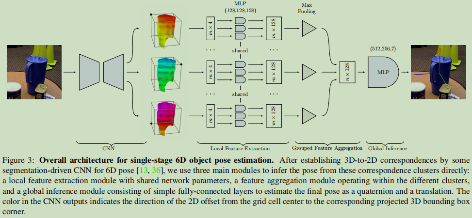

# Single-Stage 6D Object Pose Estimation

## Abstract

大多数RGB方法，RANSAC+PnP是suboptimal的：1.不是End-to-End可训练的;2.一个代理的损失不是直接推断6D姿态的。通过correspondences来推断6D，可以与其他correspondences算法结合。

当group的顺序固定，关键点的顺序是无关的？

给了张图：关键点的2D errror相同的情况下会得到两组不同的点，产生两个不同的位姿估计结果;就算同一组关键点预测改变顺序也可以得到不同的位置姿态结果。

##  Introduction

第一句话，6D姿态的应用，一堆文献;第二局话，SOTA方法（主要工作范式），一堆文献。

之前的范式存在的问题：1.损失函数不直接反映6D姿态;2.两步法不能直接End-to-End训练;3.RANSAC方法太耗费时间。

深度学习的方法可以解决，RANSAC问题，但是仍然耗时，不可重复，存在误差（因为图的原因）：

> DSAC – Differentiable RANSAC for Camera Localization 2017
>
>  Neural-Guided RANSAC: Learning Where to Sample Model Hypotheses 2019
>
>  Eigendecomposition-Free Training of Deep Networks with Zero Eigenvalue-Based Losses.
>
> Backpropagation-Friendly Eigendecomposition 2019NIPS

所以目前还没有End-to-End的方法，所以有了本文的方法：Its architecture explicitly encodes that the order of the correspondences in each group is irrelevant, while exploiting the fact that the order of the groups is fixed and corresponds to that of the 3D keypoints？

实验将本文的方法与两个two-stage结合，显示结果系统性的提高，并且可重复。

## Related Wrok

传统方法，一堆文献，问题是遮挡和cluttered背景。（主要集中在RGB方法中）

深度学习方法：直接回归（效果不行）;关键点+PnP方法，如上所述，效果较好，但是种种受限。

我们的目标是去改进two-stage的方法，但是并不trivial。有一些方法可以用神经网络做PnP和RANSAC但是都有问题，不能直接使用。

inspired by PointNet？

## Approach

先说 3D-2D correspondences的表示方法：点形式的，和vector形式的（PvNet）集合

### 集合的性质

1. 按照对应的3D点分为cluster，cluster的顺序是固定的，cluster内的点顺序（需要）无关。
2. cluster内的点存在一个噪音，神经网络需要能够捕获这种噪音的分布，但是一个cluster不能告诉任何pose的信息。然后又在cluster之间综合，获取最终的pose信息。
3. 使用PointNet处理3D点云数据的时候，需要对钢体变换无关，但是本文却需要与钢体变换有关。

### 网络结构

三个主要部分：

1. 局部特征提取：MLP;cluster内的点变为一个更长的向量
2. 组合特征结合：cluster内长向量表示的点Maxpooling+Concatenation变为一个n个点的的长矩阵。注意这里说normalization对提升性能没有帮助。
3. 全局推理：三次全连接，直接回归四元数和平移变换。

### single-stage估计方法

在训练关键点预测方法的时候，根据实验结果，设置了一个cube的八个点（类似NOCS），将自己的方法改为了4D的输入。

损失函数：
$$
\mathcal{L}= \mathcal{L}_s + \mathcal{L}_k + \mathcal{L}_p
$$
$\mathcal{L}_s$为分割损失，用的是Focal Loss ，$\mathcal{L}_k$关键点损失，$\mathcal{L}_p$姿态损失（将平移变换归一化）
$$
\mathcal{L}_p=\frac{1}{n}\sum_{i=1}^{n}{\left \| {(\hat{R}p_i+\hat{t})-(Rp_i+t)}\right \|}
$$
输出的维度是$H\times W\times C$，其中$C=(S+1)+2\times n$，$S+1$为object的数量+1个背1景类别。

## Experiments

### 合成数据上的实验

这篇文章实际上提出了一个PnP方法，所以按照PnP算法的测试方法进行测试

